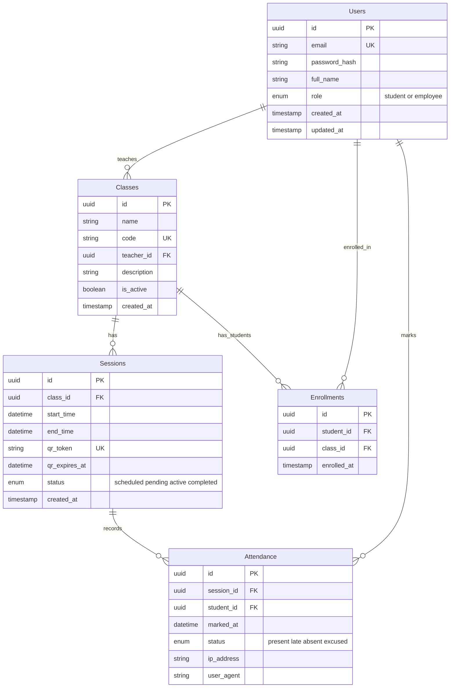
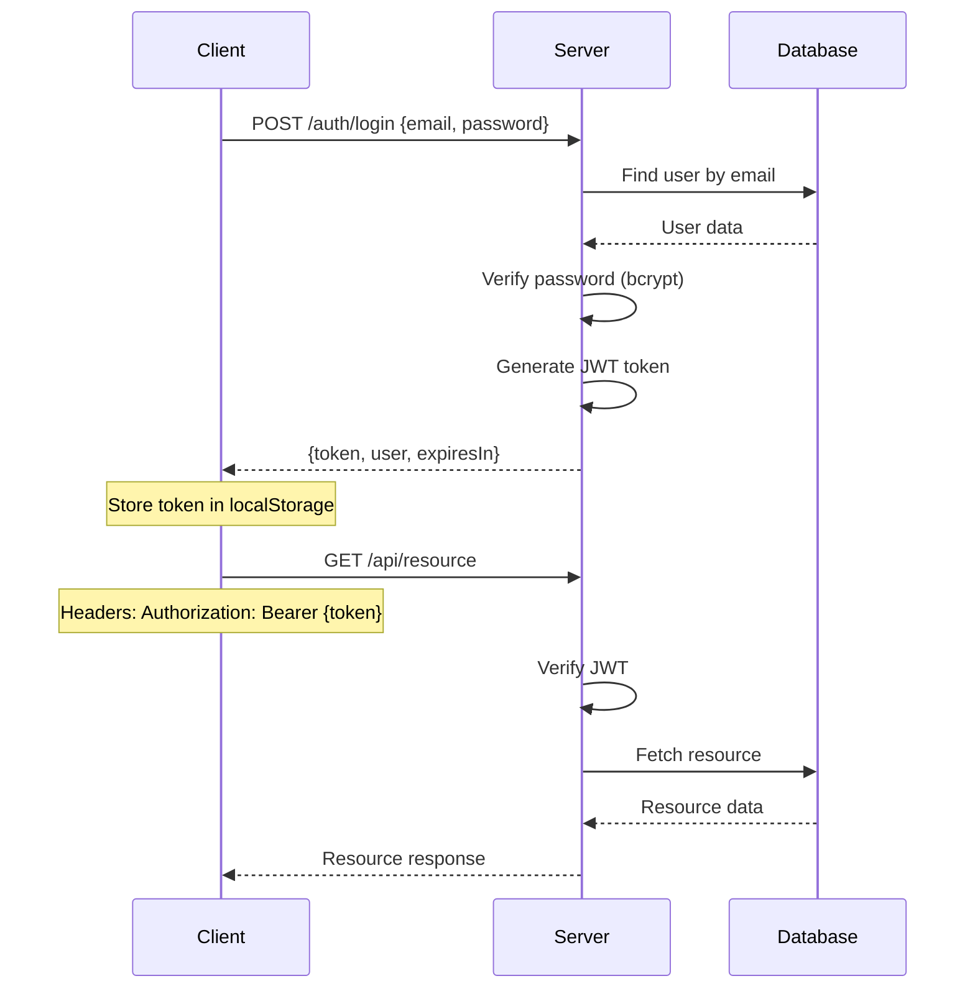
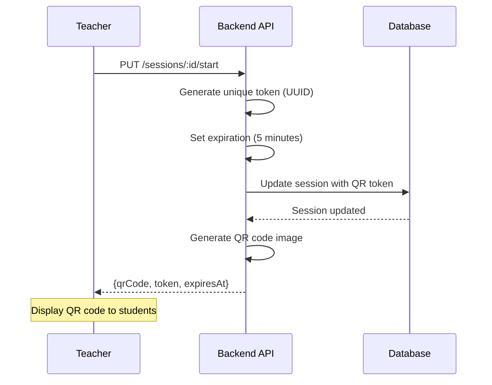
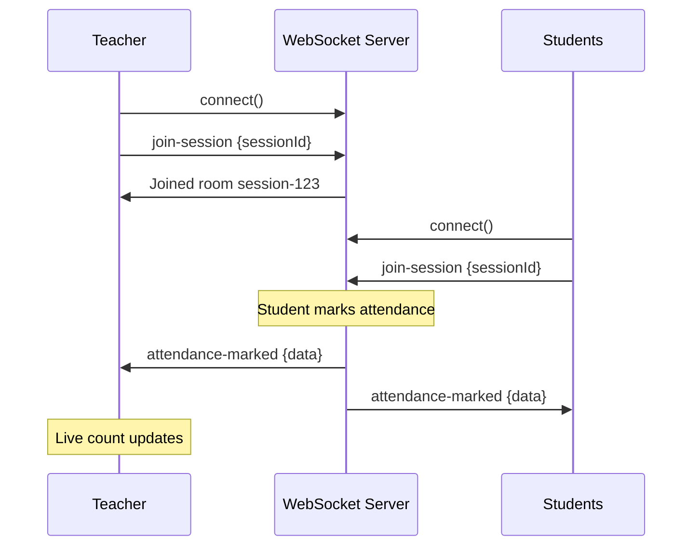
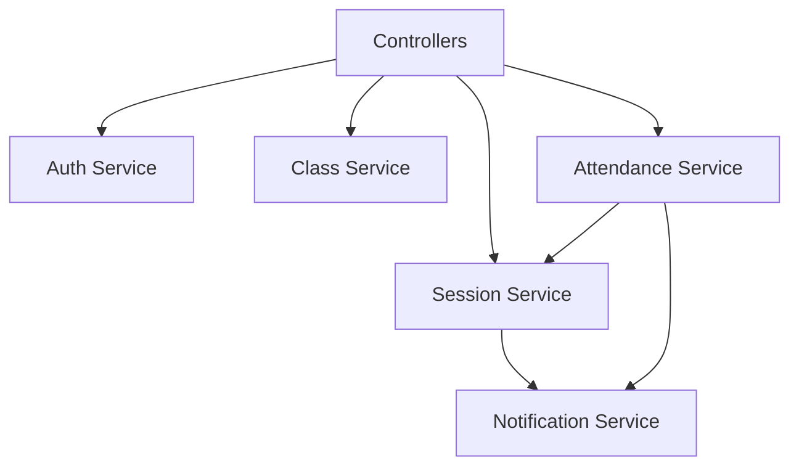

# Backend System Design - QR-Based Attendance System

## 1. Backend Architecture Overview

### 1.1 Technology Stack
```yaml
Runtime: Node.js 18 LTS
Framework: Express.js
Language: TypeScript
Database ORM: Prisma
Authentication: JWT + bcrypt
Validation: Joi/Zod
WebSocket: Socket.io
QR Generation: qrcode
Logger: Winston
Process Manager: PM2
```

### 1.2 Core Backend Services
- **Authentication Service**: JWT-based auth with bcrypt password hashing
- **QR Code Service**: Dynamic QR generation with time-limited tokens
- **Attendance Service**: Real-time attendance tracking and validation
- **WebSocket Service**: Live updates for attendance status
- **Report Service**: Generate attendance reports and analytics

## 2. Database Design



## 3. API Architecture

### 3.1 RESTful API Structure
```
Base URL: https://api.elliyatest.click
Version: /api/v1
Format: JSON
Authentication: Bearer Token (JWT)
```

### 3.2 API Endpoints

#### Authentication Endpoints
```yaml
POST   /api/v1/auth/login
  Body: { email, password }
  Response: { token, user, expiresIn }

POST   /api/v1/auth/register
  Body: { email, password, fullName, role }
  Response: { token, user }

POST   /api/v1/auth/refresh
  Body: { refreshToken }
  Response: { token, expiresIn }

POST   /api/v1/auth/logout
  Headers: Authorization
  Response: { message }

GET    /api/v1/auth/verify
  Headers: Authorization
  Response: { valid, user }
```

#### User Management
```yaml
GET    /api/v1/users/profile
  Headers: Authorization
  Response: { user }

PUT    /api/v1/users/profile
  Headers: Authorization
  Body: { fullName, email }
  Response: { user }

GET    /api/v1/users/classes
  Headers: Authorization
  Response: { classes[] } (for teachers)

GET    /api/v1/users/enrollments
  Headers: Authorization
  Response: { enrollments[] } (for students)
```

#### Class Management
```yaml
GET    /api/v1/classes
  Headers: Authorization
  Response: { classes[] }

POST   /api/v1/classes
  Headers: Authorization (teacher only)
  Body: { name, code, description }
  Response: { class }

PUT    /api/v1/classes/:id
  Headers: Authorization (teacher only)
  Body: { name, description, isActive }
  Response: { class }

DELETE /api/v1/classes/:id
  Headers: Authorization (teacher only)
  Response: { message }

POST   /api/v1/classes/:id/enroll
  Headers: Authorization (student only)
  Response: { enrollment }
```

#### Session Management
```yaml
GET    /api/v1/sessions/class/:classId
  Headers: Authorization
  Response: { sessions[] }

POST   /api/v1/sessions
  Headers: Authorization (teacher only)
  Body: { classId, startTime, endTime }
  Response: { session }

PUT    /api/v1/sessions/:id/start
  Headers: Authorization (teacher only)
  Response: { session, qrCode }

PUT    /api/v1/sessions/:id/end
  Headers: Authorization (teacher only)
  Response: { session, attendanceCount }

POST   /api/v1/sessions/:id/qr
  Headers: Authorization (teacher only)
  Response: { qrCode, expiresAt }
```

#### Attendance Endpoints
```yaml
POST   /api/v1/attendance/mark
  Headers: Authorization (student)
  Body: { qrToken }
  Response: { attendance, message }

GET    /api/v1/attendance/session/:sessionId
  Headers: Authorization (teacher)
  Response: { attendanceRecords[] }

GET    /api/v1/attendance/student/:studentId
  Headers: Authorization
  Response: { attendanceHistory[] }

GET    /api/v1/attendance/class/:classId/report
  Headers: Authorization (teacher)
  Query: { startDate, endDate }
  Response: { report, statistics }
```

## 4. Authentication & Authorization Flow

### 4.1 JWT Token Structure
```yaml
Access Token:
  Payload:
    - userId: UUID
    - email: string
    - role: 'student' | 'employee'
    - iat: issued at
    - exp: expires in 24h

Refresh Token:
  - Stored in httpOnly cookie
  - Expires in 7 days
  - Used to get new access token
```

### 4.2 Authentication Flow


### 4.3 Role-Based Access Control
```yaml
Public Routes:
  - POST /auth/login
  - POST /auth/register
  - GET /health

Student Routes:
  - POST /attendance/mark
  - GET /attendance/student/:id
  - POST /classes/:id/enroll
  - GET /users/enrollments

Employee Routes:
  - POST /classes
  - PUT /classes/:id
  - DELETE /classes/:id
  - POST /sessions
  - PUT /sessions/:id/start
  - GET /attendance/class/:id/report

Shared Routes (Authenticated):
  - GET /users/profile
  - PUT /users/profile
  - GET /classes
```

## 5. QR Code System Design

### 5.1 QR Token Generation Flow


### 5.2 QR Token Structure
```yaml
Token Format: UUID v4
Storage: In session table
Expiration: 5 minutes (configurable)
Refresh: Automatic every 5 minutes
Validation Rules:
  - Token must exist
  - Token not expired
  - Session is active
  - Student is enrolled
  - Not already marked
```

## 6. WebSocket Events

### 6.1 Event Types
```yaml
Server Events (Emit):
  attendance-marked:
    Data: { studentId, studentName, markedAt, totalPresent }
    Room: session-{sessionId}
    
  qr-updated:
    Data: { qrCode, expiresAt }
    Room: session-{sessionId}
    
  session-started:
    Data: { sessionId, className, startTime }
    Room: class-{classId}
    
  session-ended:
    Data: { sessionId, totalAttendance, endTime }
    Room: session-{sessionId}

Client Events (Listen):
  join-session:
    Data: { sessionId }
    Action: Join room for live updates
    
  leave-session:
    Data: { sessionId }
    Action: Leave room
```

### 6.2 Real-time Flow


## 7. Service Layer Architecture

### 7.1 Service Responsibilities
```yaml
AuthService:
  - User registration
  - Login validation
  - Token generation/refresh
  - Password hashing

ClassService:
  - CRUD operations
  - Enrollment management
  - Class validation

SessionService:
  - Session creation
  - Start/end sessions
  - QR token management
  - Status updates

AttendanceService:
  - Mark attendance
  - Validate QR tokens
  - Generate reports
  - Calculate statistics

NotificationService:
  - Send emails
  - WebSocket broadcasts
  - Push notifications (future)
```

### 7.2 Service Dependencies


## 8. Error Handling Strategy

### 8.1 Error Response Format
```yaml
Error Structure:
  {
    "success": false,
    "error": {
      "code": "ERROR_CODE",
      "message": "Human readable message",
      "details": {} // Optional additional info
    },
    "timestamp": "2024-01-01T00:00:00Z"
  }
```

### 8.2 Common Error Codes
```yaml
Authentication Errors:
  - AUTH_INVALID_CREDENTIALS
  - AUTH_TOKEN_EXPIRED
  - AUTH_TOKEN_INVALID
  - AUTH_UNAUTHORIZED

Validation Errors:
  - VALIDATION_FAILED
  - INVALID_INPUT
  - MISSING_REQUIRED_FIELD

Business Logic Errors:
  - SESSION_NOT_ACTIVE
  - QR_TOKEN_EXPIRED
  - ALREADY_MARKED_ATTENDANCE
  - NOT_ENROLLED
  - CLASS_FULL

System Errors:
  - INTERNAL_SERVER_ERROR
  - DATABASE_ERROR
  - SERVICE_UNAVAILABLE
```

## 9. Security Measures

### 9.1 Application Security
```yaml
Authentication:
  - JWT with 24-hour expiration
  - Refresh token rotation
  - Password complexity requirements
  - Account lockout after 5 failed attempts

API Security:
  - Rate limiting: 100 requests/minute per IP
  - CORS configuration for frontend domain
  - Helmet.js for security headers
  - Input validation on all endpoints
  - SQL injection prevention via Prisma ORM

Data Protection:
  - Passwords hashed with bcrypt (12 rounds)
  - No sensitive data in logs
  - HTTPS only communication
  - Environment variables for secrets
```

### 9.2 QR Code Security
```yaml
Token Security:
  - UUID v4 for unpredictability
  - 5-minute expiration
  - Single-use tokens
  - Session-bound validation
  
Validation Checks:
  - Token exists and not expired
  - Session is currently active
  - Student is enrolled in class
  - No duplicate attendance
  - Request from authenticated user
```

## 10. Performance Considerations

### 10.1 Database Optimization
```yaml
Indexes:
  - users.email (unique)
  - classes.code (unique)
  - sessions.qr_token (unique)
  - attendance.(session_id, student_id)
  - enrollments.(class_id, student_id)

Query Optimization:
  - Use select specific fields
  - Pagination for large datasets
  - Eager loading for relations
  - Connection pooling
```

### 10.2 API Performance
```yaml
Caching Strategy:
  - Cache class lists (5 minutes)
  - Cache user enrollments (10 minutes)
  - No caching for attendance data

Response Optimization:
  - Gzip compression
  - Minimal JSON payloads
  - Pagination (default 20 items)
  - Async/await for all operations
```

## 11. Logging & Monitoring

### 11.1 Logging Strategy
```yaml
Log Levels:
  - ERROR: System errors, failures
  - WARN: Deprecated APIs, retry attempts
  - INFO: Requests, responses, business events
  - DEBUG: Detailed debugging (dev only)

What to Log:
  - All API requests (method, path, duration)
  - Authentication attempts
  - QR code generation/validation
  - Attendance marking
  - Errors with stack traces
  - WebSocket connections

What NOT to Log:
  - Passwords
  - JWT tokens
  - Personal information
```

### 11.2 Monitoring Points
```yaml
Application Metrics:
  - API response times
  - Error rates by endpoint
  - Active WebSocket connections
  - QR generation rate
  - Attendance success rate

Business Metrics:
  - Daily active users
  - Classes per day
  - Attendance rate
  - Peak usage hours
```