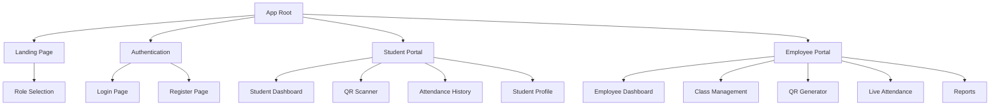
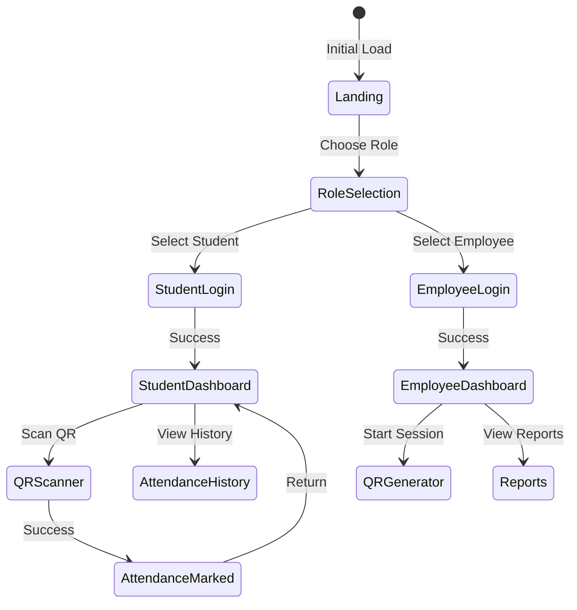

# Frontend System Design - QR-Based Attendance System

## 1. Frontend Architecture Overview

### 1.1 Technology Stack
```yaml
Framework: React 18 with TypeScript
Styling: Tailwind CSS
State Management: Context API + useReducer
Routing: React Router v6
QR Scanner: react-qr-scanner
QR Generator: qrcode.js
Real-time: Socket.io-client
HTTP Client: Axios
Build Tool: Vite
Deployment: AWS S3 Static Hosting
```

### 1.2 Application Structure
```
src/
├── components/          # Reusable UI components
│   ├── common/         # Shared components
│   ├── auth/          # Authentication components
│   ├── student/       # Student-specific components
│   └── employee/      # Employee-specific components
├── pages/              # Page components
│   ├── public/        # Public pages
│   ├── student/       # Student portal pages
│   └── employee/      # Employee portal pages
├── hooks/              # Custom React hooks
├── contexts/           # React contexts
├── services/           # API and external services
├── utils/              # Helper functions
├── types/              # TypeScript type definitions
└── assets/             # Static assets
```

## 2. User Interface Architecture

### 2.1 Page Hierarchy


### 2.2 Component Architecture
```yaml
Layout Components:
  - AppLayout: Main application wrapper
  - PublicLayout: Layout for public pages
  - StudentLayout: Student portal layout
  - EmployeeLayout: Employee portal layout

Common Components:
  - Header: Navigation bar
  - Sidebar: Side navigation (employee)
  - Footer: App footer
  - LoadingSpinner: Loading indicator
  - ErrorBoundary: Error handling wrapper
  - Modal: Reusable modal component
  - Alert: Notification component

Feature Components:
  - QRScanner: Camera-based QR scanner
  - QRDisplay: QR code display with timer
  - AttendanceCard: Individual attendance record
  - ClassCard: Class information display
  - LiveCounter: Real-time attendance counter
  - ReportGenerator: Report creation interface
```

## 3. Routing & Navigation

### 3.1 Route Structure
```yaml
Public Routes:
  /: Landing page
  /login: Login page
  /register: Registration page
  /about: About page

Student Routes:
  /student: Student dashboard
  /student/scan: QR scanner
  /student/attendance: Attendance history
  /student/classes: Enrolled classes
  /student/profile: Profile settings

Employee Routes:
  /employee: Employee dashboard
  /employee/classes: Class management
  /employee/sessions: Session management
  /employee/qr: QR code generator
  /employee/attendance: Live attendance view
  /employee/reports: Reports & analytics

Protected Route Rules:
  - Redirect to login if not authenticated
  - Redirect to correct portal based on role
  - 404 page for invalid routes
```

### 3.2 Navigation Flow


## 4. State Management Design

### 4.1 Global State Structure
```yaml
Authentication Context:
  user:
    id: string
    email: string
    fullName: string
    role: 'student' | 'employee'
  isAuthenticated: boolean
  isLoading: boolean
  error: string | null

Theme Context:
  theme: 'light' | 'dark'
  primaryColor: string

Notification Context:
  notifications: Array<{
    id: string
    type: 'success' | 'error' | 'info'
    message: string
    duration: number
  }>
```

### 4.2 Feature-Specific State
```yaml
Student State:
  attendance:
    records: AttendanceRecord[]
    statistics: {
      totalClasses: number
      attended: number
      percentage: number
    }
  scanner:
    isScanning: boolean
    lastScan: ScanResult | null

Employee State:
  classes:
    list: Class[]
    selected: Class | null
  activeSession:
    id: string
    qrCode: string
    expiresAt: Date
    attendees: Student[]
    liveCount: number
  reports:
    filters: ReportFilters
    data: ReportData[]
```

## 5. User Interface Design

### 5.1 Design System
```yaml
Colors:
  Primary: Blue (#3B82F6)
  Secondary: Purple (#8B5CF6)
  Success: Green (#10B981)
  Warning: Yellow (#F59E0B)
  Error: Red (#EF4444)
  Neutral: Gray scale

Typography:
  Font Family: Inter, system-ui
  Headings: Bold, varied sizes
  Body: Regular, 16px base
  Captions: 14px, gray-600

Spacing:
  Base unit: 4px
  Common: 8px, 16px, 24px, 32px

Components:
  Border Radius: 8px (default)
  Shadow: Small, medium, large
  Transitions: 200ms ease
```

### 5.2 Responsive Design
```yaml
Breakpoints:
  Mobile: 0-639px
  Tablet: 640px-1023px
  Desktop: 1024px+

Mobile Adaptations:
  - Single column layouts
  - Bottom navigation
  - Full-screen modals
  - Touch-friendly buttons (min 44px)
  - Swipe gestures for navigation

Tablet Adaptations:
  - Two column layouts
  - Side navigation drawer
  - Floating action buttons
  - Responsive grid system

Desktop Adaptations:
  - Multi-column layouts
  - Fixed sidebar navigation
  - Hover states
  - Keyboard shortcuts
```

## 6. Student Portal Features

### 6.1 QR Scanner Interface
```yaml
Scanner View:
  - Full-screen camera view
  - Scanning indicator overlay
  - Instructions text
  - Cancel button
  - Auto-focus on QR detection

Success State:
  - Green checkmark animation
  - Class name display
  - Timestamp
  - Auto-redirect after 3 seconds

Error States:
  - Invalid QR: Red overlay with message
  - Expired QR: Show expiration message
  - Already marked: Show previous timestamp
  - Not enrolled: Enrollment prompt
```

### 6.2 Attendance History View
```yaml
List View:
  - Grouped by month
  - Color-coded status (present/late/absent)
  - Filter by class
  - Search functionality
  - Pull to refresh

Detail View:
  - Class information
  - Session date/time
  - Marked timestamp
  - Status badge
  - Location (if available)

Statistics Dashboard:
  - Overall percentage
  - Monthly chart
  - Class-wise breakdown
  - Streak counter
```

## 7. Employee Portal Features

### 7.1 QR Generator Interface
```yaml
Session Setup:
  - Class selection dropdown
  - Session duration setter
  - Start session button
  - Advanced options toggle

QR Display:
  - Large QR code (min 300x300px)
  - Countdown timer
  - Session details
  - Refresh button
  - End session button

Live View Split Screen:
  - Left: QR code display
  - Right: Live attendance list
  - Top: Statistics bar
  - Bottom: Control buttons
```

### 7.2 Reports Interface
```yaml
Report Filters:
  - Date range picker
  - Class multi-select
  - Status filter
  - Export format selector

Report Display:
  - Summary statistics cards
  - Attendance table
  - Visualization charts
  - Export button
  - Print preview

Chart Types:
  - Line chart: Attendance over time
  - Bar chart: Class comparison
  - Pie chart: Status distribution
  - Heatmap: Weekly patterns
```

## 8. Real-time Features

### 8.1 WebSocket Integration
```yaml
Connection Management:
  - Auto-connect on app load
  - Reconnection with backoff
  - Connection status indicator
  - Error handling

Event Subscriptions:
  Student Events:
    - attendance-confirmed
    - session-started
    - session-ended
    
  Employee Events:
    - attendance-marked
    - student-joined
    - qr-refreshed
    - session-stats-update
```

### 8.2 Live Updates UI
```yaml
Attendance Counter:
  - Animated number increment
  - Progress bar
  - Percentage display
  - Color change on milestones

Student List:
  - Real-time addition
  - Fade-in animation
  - Status indicators
  - Timestamp display

Notifications:
  - Toast notifications
  - Sound alerts (optional)
  - Badge updates
  - Push notifications (future)
```

## 9. Performance Optimization

### 9.1 Code Optimization
```yaml
Bundle Optimization:
  - Code splitting by route
  - Lazy loading components
  - Tree shaking unused code
  - Minification & compression

Asset Optimization:
  - Image lazy loading
  - WebP format for images
  - SVG for icons
  - Font subsetting

Caching Strategy:
  - Browser caching headers
  - Service worker (PWA)
  - API response caching
  - Local storage for preferences
```

### 9.2 Runtime Performance
```yaml
React Optimizations:
  - Memo for expensive components
  - useCallback for functions
  - useMemo for calculations
  - Virtual scrolling for lists

State Management:
  - Minimize re-renders
  - Batch state updates
  - Debounce search inputs
  - Throttle scroll events

API Optimization:
  - Request debouncing
  - Pagination
  - Infinite scroll
  - Optimistic updates
```

## 10. Accessibility & UX

### 10.1 Accessibility Features
```yaml
WCAG Compliance:
  - Semantic HTML elements
  - ARIA labels and roles
  - Keyboard navigation
  - Focus management
  - Screen reader support

Visual Accessibility:
  - High contrast mode
  - Font size controls
  - Color blind friendly
  - Reduced motion option
  - Clear focus indicators
```

### 10.2 User Experience
```yaml
Onboarding:
  - Welcome tour (first login)
  - Feature tooltips
  - Help documentation
  - Video tutorials

Error Handling:
  - User-friendly messages
  - Recovery suggestions
  - Retry mechanisms
  - Fallback UI

Loading States:
  - Skeleton screens
  - Progress indicators
  - Optimistic updates
  - Stale-while-revalidate
```

## 11. Security Considerations

### 11.1 Client-Side Security
```yaml
Authentication:
  - JWT storage in memory/localStorage
  - Auto logout on inactivity
  - Token refresh mechanism
  - Secure route protection

Data Protection:
  - Input sanitization
  - XSS prevention
  - HTTPS only
  - No sensitive data in URLs
```

### 11.2 API Security
```yaml
Request Security:
  - CORS configuration
  - API request signing
  - Rate limiting awareness
  - Error message sanitization

Session Security:
  - Timeout handling
  - Multi-tab synchronization
  - Logout on all tabs
  - Clear data on logout
```

## 12. Deployment & Build

### 12.1 Build Configuration
```yaml
Production Build:
  - Environment variables
  - API endpoint configuration
  - Source maps (optional)
  - Bundle analysis

Build Output:
  - Static HTML/CSS/JS
  - Compressed assets
  - Hashed filenames
  - robots.txt & sitemap
```

### 12.2 Deployment Strategy
```yaml
S3 Deployment:
  - Build locally or CI/CD
  - Upload to S3 bucket
  - CloudFront invalidation
  - Environment-specific builds

Monitoring:
  - Error tracking (Sentry)
  - Analytics (Google Analytics)
  - Performance monitoring
  - User feedback widget
```