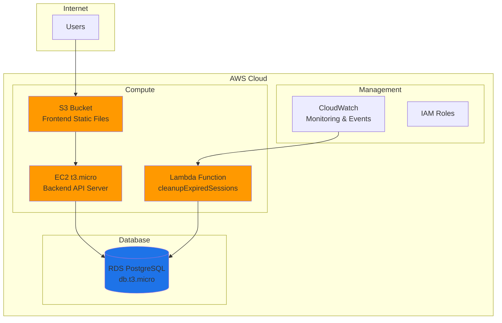

# Infrastructure System Design - QR-Based Attendance System

## 1. Infrastructure Overview

### 1.1 AWS Services Used
```yaml
Cloud Provider: AWS
Frontend Hosting: S3 (Static Website)
Backend Hosting: EC2 t3.micro
Database: RDS PostgreSQL db.t3.micro
Serverless: Lambda (1 function for cleanup)
Monitoring: CloudWatch (Basic)
DNS: Route 53 (Optional)
```

### 1.2 Architecture Diagram


## 2. Network Architecture

### 2.1 VPC Configuration
```yaml
VPC: Default VPC (Free)
CIDR: 172.31.0.0/16
Region: us-east-1
Availability Zones: us-east-1a, us-east-1b
```

### 2.2 Security Groups

```yaml
backend-sg:
  Description: Security group for EC2 backend
  Inbound Rules:
    - Port 22 (SSH) from Your-IP
    - Port 80 (HTTP) from 0.0.0.0/0
    - Port 443 (HTTPS) from 0.0.0.0/0
    - Port 3000 (Node.js) from 0.0.0.0/0
  Outbound Rules:
    - All traffic to 0.0.0.0/0

database-sg:
  Description: Security group for RDS
  Inbound Rules:
    - Port 5432 (PostgreSQL) from backend-sg
  Outbound Rules:
    - None
```

## 3. Compute Resources

### 3.1 EC2 Instance Configuration
```yaml
Instance Details:
  Name: attendance-backend
  Type: t3.micro
  vCPUs: 1
  Memory: 1 GB
  Storage: 8 GB gp3
  OS: Ubuntu Server 20.04 LTS
  
Network:
  Public IP: Enabled
  Subnet: Default public subnet
  Security Group: backend-sg
  
Cost:
  Free Tier: 750 hours/month (12 months)
  After Free Tier: ~$8.50/month
```

### 3.2 Lambda Function Configuration
```yaml
Function Details:
  Name: cleanupExpiredSessions
  Runtime: Node.js 18.x
  Architecture: x86_64
  Memory: 128 MB
  Timeout: 60 seconds
  
Trigger:
  Source: CloudWatch Events
  Schedule: rate(1 hour)
  
Permissions:
  - VPC Access (to reach RDS)
  - CloudWatch Logs
  
Environment Variables:
  DATABASE_URL: RDS connection string
  
Cost: Free (1M requests/month free tier)
```

## 4. Storage Resources

### 4.1 S3 Bucket Configuration
```yaml
Bucket Details:
  Name: attendance-system-frontend
  Region: us-east-1
  
Static Website Hosting:
  Enabled: Yes
  Index Document: index.html
  Error Document: error.html
  
Bucket Policy:
  Public Read Access: Enabled
  
CORS Configuration:
  Allowed Origins: *
  Allowed Methods: GET, HEAD
  
Cost:
  Free Tier: 5 GB storage
  After: $0.023/GB/month
```

### 4.2 RDS Database Configuration
```yaml
Database Details:
  Engine: PostgreSQL 14
  Instance Class: db.t3.micro
  vCPUs: 1
  Memory: 1 GB
  Storage: 20 GB gp2
  
Network:
  Multi-AZ: No
  Publicly Accessible: No
  Subnet Group: Default
  Security Group: database-sg
  
Backup:
  Automated Backups: Disabled (save cost)
  
Maintenance:
  Auto Minor Version Upgrade: Yes
  Window: sun:05:00-sun:05:30
  
Cost:
  Free Tier: 750 hours/month (12 months)
  After Free Tier: ~$12.50/month
```

## 5. IAM Roles & Policies

### 5.1 Lambda Execution Role
```yaml
Role Name: lambda-cleanup-role
Policies:
  - AWSLambdaBasicExecutionRole
  - AWSLambdaVPCAccessExecutionRole
  
Custom Policy:
  - RDS read/write access
  - CloudWatch Logs write
```

### 5.2 EC2 Instance Role
```yaml
Role Name: ec2-backend-role
Policies:
  - S3 read access (for assets)
  - CloudWatch Logs write
  - Secrets Manager read (optional)
```

## 6. Monitoring Setup

### 6.1 CloudWatch Configuration
```yaml
Basic Monitoring (Free):
  EC2 Metrics:
    - CPU Utilization
    - Network In/Out
    - Disk Read/Write
    
  RDS Metrics:
    - CPU Utilization
    - Database Connections
    - Free Storage Space
    
  Lambda Metrics:
    - Invocations
    - Duration
    - Errors
    
Alarms (Optional):
  - EC2 CPU > 80%
  - RDS Storage < 1GB
  - Lambda Errors > 0
```

## 7. Domain & DNS

### 7.1 Domain Setup
```yaml
Domain: elliyatest.click

Option 1 - Using Route 53:
  Type: A Record
  Value: EC2 Public IP
  TTL: 300
  Cost: $0.50/month for hosted zone

Option 2 - External DNS:
  Use domain registrar's DNS
  Point A record to EC2 IP
  Cost: Free
```

## 8. Deployment Configuration

### 8.1 Infrastructure Provisioning Order
```yaml
1. Create VPC (or use default)
2. Create Security Groups
3. Launch RDS instance
4. Launch EC2 instance
5. Create S3 bucket
6. Create Lambda function
7. Configure DNS
```

### 8.2 Access Configuration
```yaml
SSH Access:
  Method: SSH Key Pair
  Port: 22
  Allowed IPs: Your IP only
  
Database Access:
  Method: Through EC2 only
  No public endpoint
  
S3 Access:
  Public read for website
  Private write (from EC2)
```

## 9. Cost Optimization

### 9.1 Free Tier Usage (First 12 Months)
```yaml
Monthly Cost: $0
Services Included:
  - EC2 t3.micro: 750 hours
  - RDS t3.micro: 750 hours
  - S3: 5GB storage
  - Lambda: 1M requests
  - Data Transfer: 15GB out
```

### 9.2 Post Free Tier Costs
```yaml
Minimum Setup (~$10/month):
  Option 1 - Everything on EC2:
    - EC2 t3.micro: $8.50
    - S3 hosting: $0.50
    - Total: $9.00/month
    
  Option 2 - With RDS:
    - EC2 t3.micro: $8.50
    - RDS t3.micro: $12.50
    - S3 hosting: $0.50
    - Total: $21.50/month
```

### 9.3 Cost Saving Tips
```yaml
Development Phase:
  - Stop instances when not in use
  - Use AWS CLI: aws ec2 stop-instances
  - Schedule automatic stop/start
  
Demo Day:
  - Start instances 1 hour before
  - Have local backup ready
  - Stop immediately after
```

## 10. Infrastructure Management

### 10.1 Backup Strategy
```yaml
Simple Backup (Manual):
  - Database: pg_dump before major changes
  - Code: Git repository
  - S3: Versioning disabled (save cost)
```

### 10.2 Monitoring & Maintenance
```yaml
Daily Checks:
  - CloudWatch dashboard
  - Instance health
  - Disk usage
  
Weekly Tasks:
  - Review costs
  - Check logs
  - Update packages
```

## 11. Scaling Considerations (Future)

### 11.1 When to Scale
```yaml
Indicators:
  - CPU consistently > 70%
  - Response time > 2 seconds
  - User base > 500 active users
```

### 11.2 Scaling Options
```yaml
Vertical Scaling:
  - EC2: t3.micro → t3.small
  - RDS: db.t3.micro → db.t3.small
  
Horizontal Scaling:
  - Add Load Balancer
  - Multiple EC2 instances
  - RDS Read Replicas
```