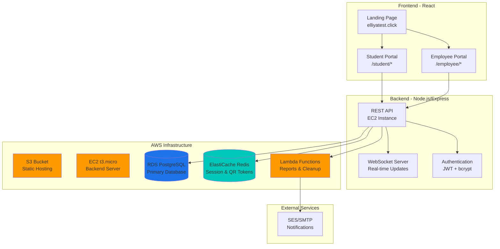
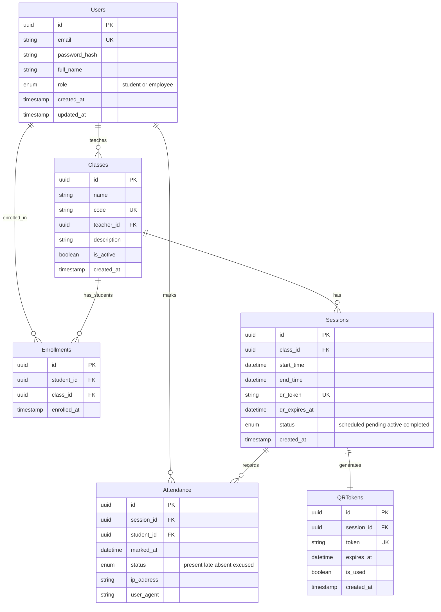
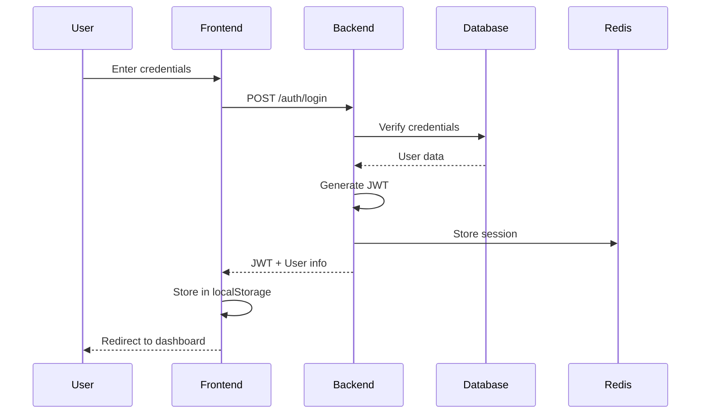
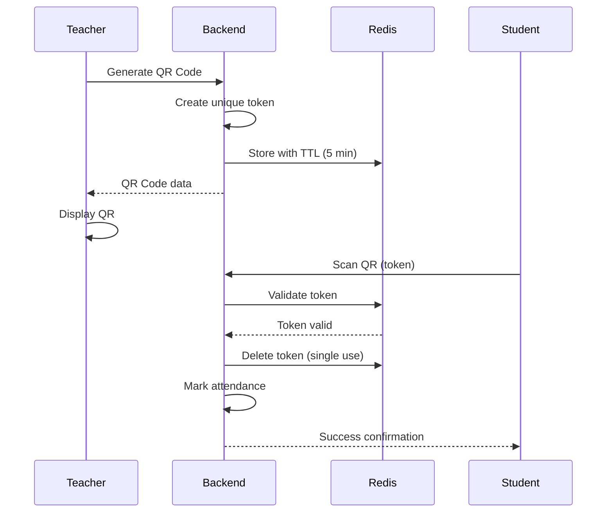

Yes, you're absolutely right! Let me organize everything we've discussed into a comprehensive system implementation design. I'll split it into 3 parts for clarity:

## Part 1: System Overview & Architecture

# 🎯 QR-Based Attendance System - Implementation Design

## 1. Project Overview

### 1.1 System Description
A web-based attendance management system using QR codes for universities, enabling real-time attendance tracking with separate portals for students and employees (teachers).

### 1.2 Core Features
- **Dynamic QR Code Generation**: Time-limited, single-use QR codes
- **Real-time Attendance Tracking**: Live updates via WebSocket
- **Role-based Access**: Separate interfaces for students and employees
- **Analytics Dashboard**: Attendance reports and insights
- **Mobile-Responsive**: Works seamlessly on all devices

## 2. System Architecture



## 3. Technology Stack

### 3.1 Frontend
```yaml
Framework: React 18 with TypeScript
Styling: Tailwind CSS
State Management: Context API + useReducer
Routing: React Router v6
QR Scanner: react-qr-scanner
QR Generator: qrcode.js
Real-time: Socket.io-client
HTTP Client: Axios
Build Tool: Vite
```

### 3.2 Backend
```yaml
Runtime: Node.js 18 LTS
Framework: Express.js
Language: TypeScript
Database ORM: Prisma
Authentication: JWT + bcrypt
Validation: Joi/Zod
WebSocket: Socket.io
QR Generation: qrcode
Task Queue: Bull (Redis-based)
Logger: Winston
```

### 3.3 Infrastructure
```yaml
Cloud Provider: AWS
Frontend Hosting: S3 + CloudFront (optional)
Backend Hosting: EC2 t3.micro
Database: RDS PostgreSQL
Cache: ElastiCache Redis
Serverless: Lambda (reports)
Monitoring: CloudWatch
Secrets: AWS Secrets Manager
```

## 4. Database Design



## 5. Security Architecture

### 5.1 Authentication Flow


### 5.2 QR Code Security


---
**Continue to Part 2?** (Frontend Implementation Details)