# QR-Based Class Attendance System

A modern, real-time attendance management system that uses dynamic QR codes to automate attendance tracking in educational institutions.

## 🎯 Overview

This system revolutionizes traditional attendance tracking by generating time-limited QR codes that students scan to mark their presence. It eliminates manual processes, reduces proxy attendance, and provides real-time analytics for educators.

## ✨ Key Features

- **Dynamic QR Generation**: Time-limited QR codes (5-minute expiration) for security
- **Real-time Tracking**: Live attendance updates via WebSocket connections
- **Dual Portal System**: Separate interfaces for students and employees
- **Mobile-First Design**: Responsive UI optimized for smartphones
- **Comprehensive Analytics**: Detailed reports and attendance statistics
- **Anti-Fraud Measures**: Single-use tokens and enrollment validation

## 🏗️ System Architecture

```mermaid
graph TB
    subgraph "Users"
        Students[👨‍🎓 Students]
        Teachers[👨‍🏫 Teachers]
    end
    
    subgraph "Frontend Layer"
        StudentApp[Student Portal<br/>React + TypeScript]
        TeacherApp[Teacher Portal<br/>React + TypeScript]
    end
    
    subgraph "Backend Layer"
        API[REST API<br/>Node.js + Express]
        WebSocket[WebSocket Server<br/>Socket.io]
        Auth[JWT Authentication]
    end
    
    subgraph "Data Layer"
        DB[(PostgreSQL<br/>Database)]
        QRService[QR Code Service<br/>Dynamic Generation]
    end
    
    subgraph "Infrastructure"
        S3[AWS S3<br/>Static Hosting]
        EC2[AWS EC2<br/>Backend Server]
        RDS[AWS RDS<br/>Database]
        Lambda[AWS Lambda<br/>Cleanup Jobs]
    end
    
    Students --> StudentApp
    Teachers --> TeacherApp
    StudentApp --> S3
    TeacherApp --> S3
    StudentApp --> API
    TeacherApp --> API
    StudentApp --> WebSocket
    TeacherApp --> WebSocket
    API --> Auth
    API --> QRService
    API --> DB
    WebSocket --> DB
    S3 --> EC2
    EC2 --> RDS
    Lambda --> RDS
    
    style Students fill:#e1f5fe
    style Teachers fill:#e8f5e8
    style StudentApp fill:#fff3e0
    style TeacherApp fill:#fff3e0
    style API fill:#f3e5f5
    style DB fill:#e8eaf6
```

## 🚀 Technology Stack

### Frontend
- **React 18** with TypeScript
- **Tailwind CSS** for styling
- **Socket.io** for real-time updates
- **React QR Scanner** for QR code scanning

### Backend
- **Node.js** with Express.js
- **Prisma ORM** with PostgreSQL
- **JWT Authentication** with bcrypt
- **Socket.io** for WebSocket communication

### Infrastructure
- **AWS S3** - Frontend hosting
- **AWS EC2** - Backend server
- **AWS RDS** - PostgreSQL database
- **AWS Lambda** - Automated cleanup tasks

## 👥 User Portals

### 🎓 Student Portal
- Full-screen QR scanner interface
- Personal attendance history and statistics
- Class enrollment management
- Real-time attendance confirmation

### 👨‍🏫 Teacher Portal
- Session management and QR generation
- Live attendance monitoring with countdown timer
- Comprehensive reports and analytics
- Class administration tools

## 🔄 Real-time Flow

## 🔒 Security Features

- **JWT Authentication** with refresh tokens
- **Time-limited QR codes** (5-minute expiration)
- **Single-use tokens** prevent replay attacks
- **Role-based access control** for different user types
- **Rate limiting** and input validation
- **Enrollment validation** prevents unauthorized access

## 📊 System Capabilities

- **Concurrent Users**: 100-200 simultaneous users
- **Real-time Updates**: Sub-second WebSocket communication
- **QR Generation**: Dynamic tokens with auto-refresh
- **Data Analytics**: Comprehensive attendance reporting
- **Mobile Support**: Camera-based QR scanning
- **Scalability**: AWS infrastructure ready for growth

## 🚀 Getting Started

1. **Check Prerequisites**: Node.js 18+, PostgreSQL, AWS account
2. **Clone Repository**: Get the source code
3. **Environment Setup**: Configure backend and frontend
4. **Database Migration**: Set up PostgreSQL schema
5. **Deploy Infrastructure**: AWS S3, EC2, and RDS setup

For detailed setup instructions, see the [Backend System Design](system-design/backend-system-design.md), [Frontend System Design](system-design/frontend-system-design.md), and [Infrastructure Design](system-design/infra-system-design.md) documents.

## 📈 Deployment Architecture

## 💰 Cost Structure

- **Free Tier**: $0/month (first 12 months on AWS)
- **Post Free Tier**: ~$21/month for full setup
- **Minimal Setup**: ~$9/month (single EC2 instance)

## 🤝 Contributing

Contributions are welcome! Please check out our system design documents for detailed technical specifications before contributing.

## 📄 Documentation

- [Backend System Design](system-design/backend-system-design.md) - API architecture, database schema, and backend services
- [Frontend System Design](system-design/frontend-system-design.md) - UI components, state management, and user experience
- [Infrastructure Design](system-design/infra-system-design.md) - AWS deployment, monitoring, and scaling strategies

## 📞 Contact

For questions or support, please open an issue in this repository.

---

**Built with ❤️ for modern education**